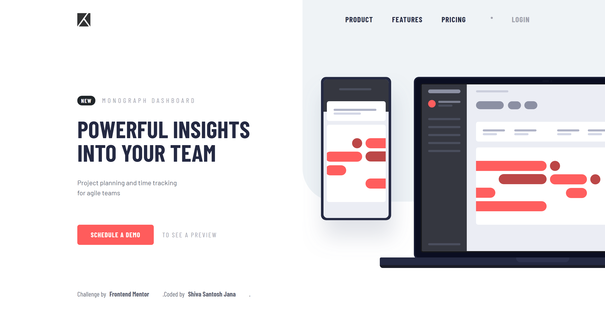
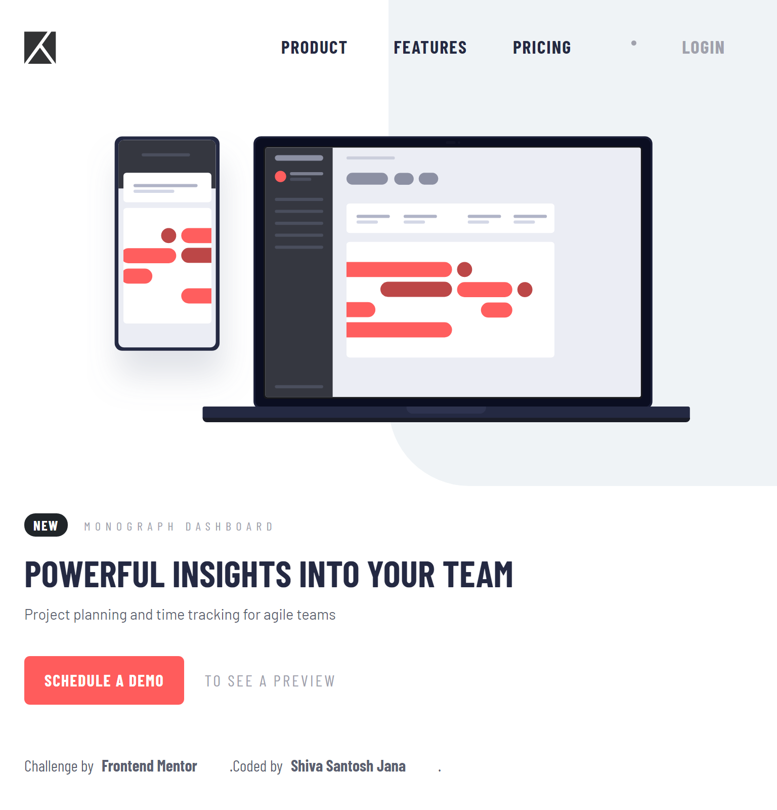
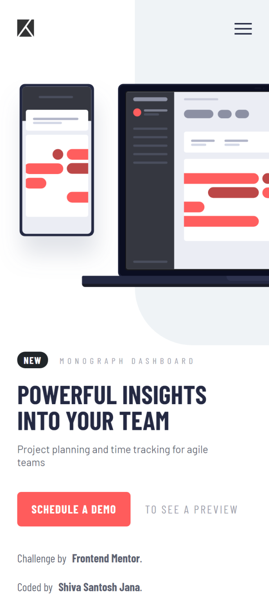

# Frontend Mentor - Project tracking intro component solution

This is a solution to the [Project tracking intro component challenge on Frontend Mentor](https://www.frontendmentor.io/challenges/project-tracking-intro-component-5d289097500fcb331a67d80e). Frontend Mentor challenges help you improve your coding skills by building realistic projects.

## Table of contents

- [Overview](#overview)
  - [The challenge](#the-challenge)
  - [Screenshots](#screenshots)
  - [Links](#links)
- [My process](#my-process)
  - [Built with](#built-with)
  - [What I learned](#what-i-learned)
  - [Continued development](#continued-development)
  - [Useful resources](#useful-resources)
- [Author](#author)

## Overview

### The challenge

Users should be able to:

- View the optimal layout for the site depending on their device's screen size
- See hover states for all interactive elements on the page
- Create the background shape using code

### Screenshots

Desktop version

Tablet version

Mobile version

### Links

- Solution URL: [Code on GitHub](https://github.com/santu369/frontendmentor-project-tracking-intro-component)
- Live Site URL: [Netlify Live URL](https://santu369-frontendmentor-project-tracking-intro-component.netlify.app/)

## My process

Worked on Mobile first approach, then added media queries, adjusting the layout.
Used React for building the app using component based approach and Bootstrap for layout.

### Built with

- Semantic HTML5 markup
- CSS custom properties
- Flexbox
- Mobile-first workflow
- BEM Methodology
- SASS
- Bootstrap
- React

### What I learned

Learned using React for splitting the application to components and styling them individually.
Applied SASS for each component separately and added some global styles and common variables to seperate file and used those when needed.
Used UseEffect hook for working with the Hamburger Mobile Menu.

- npm install --save sass: Install dart sass to use in react app.

- Netlify Build Command: npm run build

- Netlify Publish Directory: build

- Netlify considers warnings as errors by default. As a workaround, select site -> goto deploys -> open deploy settings -> click on Environment tab -> add New Variable **CI** and set its value to **false** or set build command to **CI= npm run build** or **CI=false npm run build** or **CI= yarn build** if using yarn.

### Continued development

Will use React going forward for new projects and try styled components, react routes and other hooks.

### Useful resources

- [Sass](https://sass-lang.com/) - Installing and Learning Sass.
- [BEM](https://en.bem.info/methodology/quick-start/) - Quick Start with BEM.
- [W3C Markup Validation Service](https://validator.w3.org/) - Validator for checking the markup validity of Web documents in HTML, XHTML, SMIL, MathML, etc.
- [W3C CSS Validation Service](https://jigsaw.w3.org/css-validator/) - Check Cascading Style Sheets (CSS) and (X)HTML documents with style sheets.
- [Bootstrap CSS](https://getbootstrap.com/docs/5.0/getting-started/introduction/) - Getting started with Bootstrap.
- [React](https://reactjs.org/) - Javascript library for building interfaces.
- [Solve Netlify Error](https://dev.to/kapi1/solved-treating-warnings-as-errors-because-of-process-env-ci-true-bk5) - Solve **Treating warnings as errors because of process.env.CI = true** Netlify Build Error.

## Author

- Website - [Shiva Santosh Jana](https://santu369.github.io/FreeCodeCamp-PersonalPortfolioWebpage)
- Frontend Mentor - [@santu369](https://www.frontendmentor.io/profile/santu369)
- Twitter - [@santu69](https://www.twitter.com/santu69)
